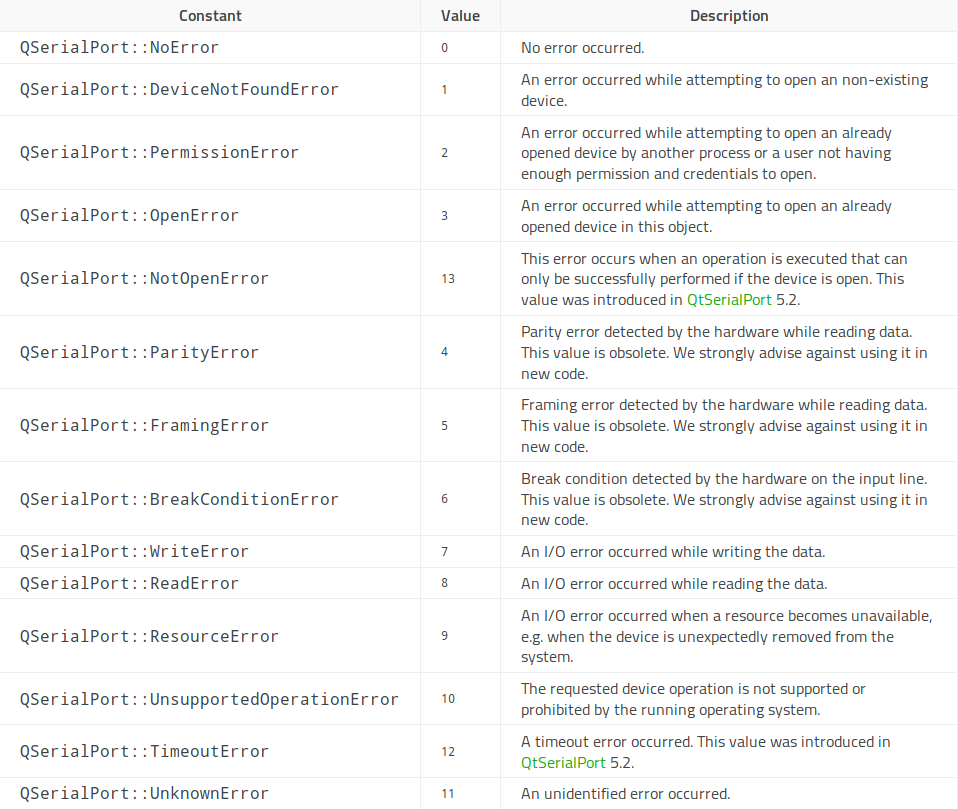

= Draw-Vinci
Andreas Hofschweiger; Kelve T. Henrique <kelvehenrique@hotmail.com>
:Date: 2018 Apr 28
:description: Documenting Draw-Vinci Makeblock XY_Plotter Project
:source-highlighter: coderay
:listing-caption: Listing
:imagesdir: img
:toc: left

== Introduction

=== Project Description

=== Formats supported

== Functionalities

=== Tools

==== Eraser

==== Line

==== Freehand

==== Text

==== Rectangle

==== Ellipse

==== Select

=== Key Combinations

==== Undoing

==== Deleting selection

== Communication

=== G-CODE Specification

Here is the subset of G-CODE currently supported

[cols="^.1s,<.3m"]
|===

|G00 | Rapid positioning
|G90 | Absolute positioning
|G91 | Relative positioning
|G01 | Linear interpolation
|G02 | Circular interpolation

|===

=== Error Table

[#portErrors]
.Possible errors codes by connection

=== Protocol

=== Building the App
The software comprising this project was built and tested using the following environment:

Hardware::
    Plotter:::
        . MakeBlock XY_Plotter
    Microcontroller:::
        . Infineon XMC4500
    Interface:::
        . UART TTL
        . USB

Operating Systems::
    Linux:::
        . Ubuntu 17.04
            * Desktop
        . Ubuntu 18.04
            * Desktop

Framework & Tools::
    GUI:::
        . PyQt5 + Qt
            .. Qt Designer
            .. pyuic5
    Firmware:::
        . Micrium
            .. uCOS III
        . Infineon
            .. XMCLIB

Dependencies::
    Python3:::
        . PyQt5
        . pyudev
    arm-none-eabi:::
        . https://launchpad.net/gcc-arm-embedded/5.0/5-2016-q3-update/+download/gcc-arm-none-eabi-5_4-2016q3-20160926-linux.tar.bz2
    SEGGER J-Link:::
        . https://www.segger.com/downloads/jlink/#J-LinkSoftwareAndDocumentationPack

=== Algorithms

==== GUI

==== XMC4500

